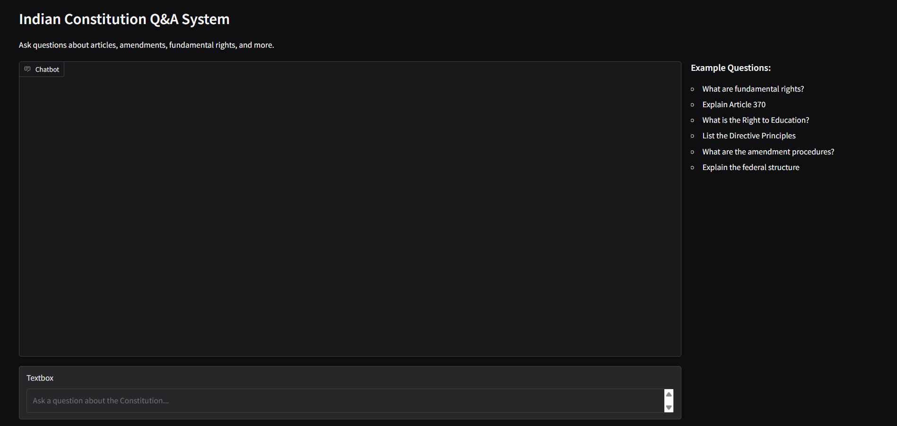
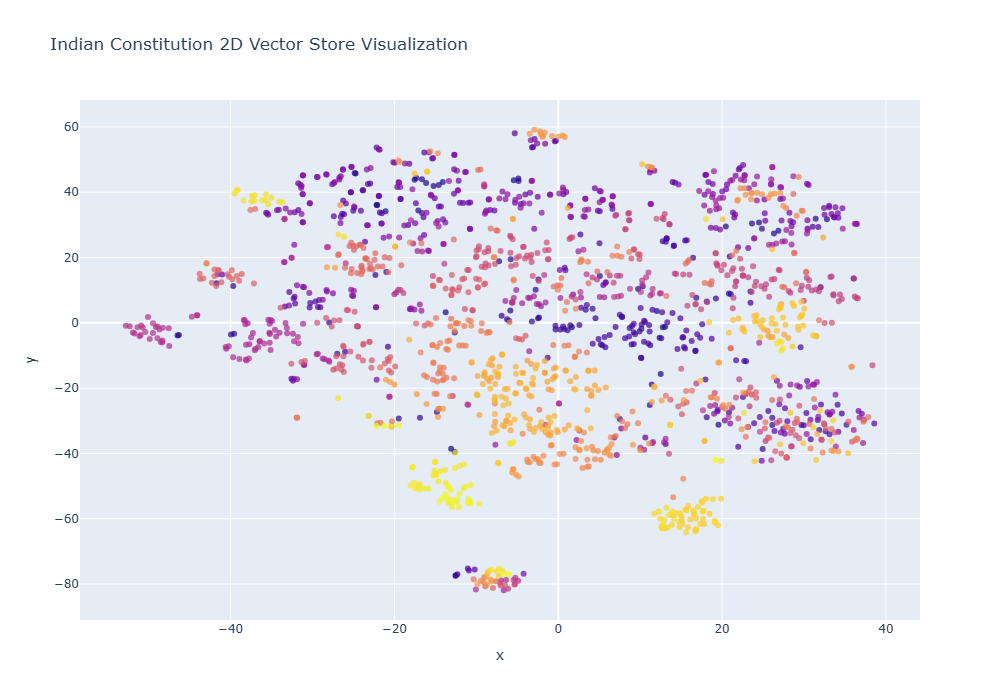
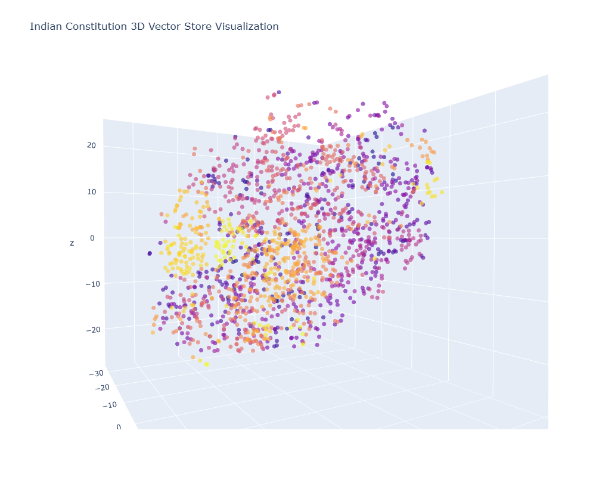

# Indian Constitution Q&A System with RAG

This project showcases a complete Retrieval-Augmented Generation pipeline that enables you to ask natural language questions about the Indian Constitution and get accurate answers. Instead of manually searching through hundreds of pages, you can simply ask questions and the system retrieves relevant context and generates responses.

## Demo

### Working Demo
[Watch the demo](demo.mp4)

### Gradio UI


### Vector Store Visualizations



## Technical Stack

- **Embeddings**: OpenAI text-embedding-3-small
- **Vector Database**: Chroma (locally stored)
- **LLM**: GPT-4o-mini
- **Framework**: LangChain
- **UI**: Gradio
- **Visualization**: Plotly with t-SNE

## Setup Instructions

### Prerequisites

- Python 3.8+
- 16GB RAM recommended
- OpenAI API key

### Installation

Create a virtual environment:

```bash
conda create -n const_rag python=3.10
conda activate const_rag
```

Install dependencies (these are also in the first cell of the notebook):

```bash
pip install -r requirements.txt
```

Set up environment variables in a `.env` file:

```
OPENAI_API_KEY=your_openai_api_key_here
```

Place your Indian Constitution PDF as `indian_constitution.pdf` in the project directory.

Run the Jupyter notebook. First run will:
- Process the PDF
- Generate embeddings
- Create vector visualizations
- Launch Gradio interface

## Usage Examples

- What are fundamental rights?
- Explain Article 370
- What is the Right to Education?
- List the Directive Principles
- What are the amendment procedures?
- Explain the federal structure

## How It Works

1. PDF is loaded and split into chunks with token size 800 (Can be experimented with)
2. Each chunk is converted to a vector embedding
3. Embeddings are stored in local ChromaDB
4. User question is converted to an embedding
5. System finds top 7 most relevant chunks via semantic search (The system had some occasional issues with some questions while using top 4)
6. Retrieved chunks + question are sent to the GPT-4o-mini model
7. LLM generates answer and also gives the exact count of sources


## Key Features

- Highly accurate responses
- 2D/3D vector space visualizations
- Interactive Gradio interface
- Local vector storage with ChromaDB

## License

This project is for educational purposes. The Indian Constitution text is in the public domain in India.